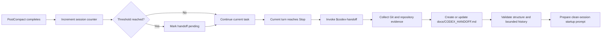

# Codex Handoff

**Long Codex sessions deserve clean continuations.**

Codex Handoff counts completed context compactions, waits until the current turn reaches a safe stopping point, then asks Codex to create a verified `docs/CODEX_HANDOFF.md` and continue in a clean session.

It is built around one principle: chat context is temporary, while repository state, Git history, tests, and explicit decisions are durable evidence.

[中文说明](README.zh-CN.md)

> Status: `v0.1.0`. Automated tests pass on the build environment. macOS and Linux are the target platforms, and the exact Plugin flow still needs a real Codex smoke test before the first public release.

## What it solves

A long coding task can survive one context compaction, but repeated compactions make it harder for a new session to answer basic questions with confidence:

- What is already complete?
- Which files are currently dirty?
- Which design decisions must be preserved?
- Which tests actually passed?
- What is the single next task?

Codex Handoff turns those questions into a repository artifact that another session can verify.

## How it works



The `PostCompact` hook only records state. It does not steer the model or interrupt tools, tests, edits, or subagents in the current turn. The `Stop` hook schedules one continuation after the task reaches a normal boundary.

## Core behavior

- **Safe boundary:** handoff starts only after the active turn reaches `Stop`.
- **Recurring threshold:** the counter resets after each handoff request, so another handoff can occur after the next configured number of compactions.
- **Evidence first:** repository files, Git, tests, generated artifacts, and applicable `AGENTS.md` files outrank chat history.
- **Dirty tree preservation:** the workflow records staged, unstaged, and untracked work without cleaning or rewriting it.
- **Bounded history:** sections 1 through 10 describe the current state; section 11 keeps only the five most recent handoffs.
- **Local operation:** the hook makes no network calls and stores only local counters and a bounded audit log.
- **Manual control:** the Skill has implicit invocation disabled and remains available through `$codex-handoff`.

## Installation

### Option 1: Codex plugin marketplace

This is the preferred distribution path for Codex surfaces that support plugins.

```bash
codex plugin marketplace add haopan036/codex-handoff
```

Then:

1. Open `/plugins` in Codex CLI, or open the Plugins Directory in the ChatGPT desktop app.
2. Select the `Codex Handoff` marketplace and install `Codex Handoff`.
3. Review the bundled hook definition and explicitly trust it.
4. Start a new Codex session.

Plugin installation uses the repository marketplace at `.agents/plugins/marketplace.json` and the plugin package at `plugins/codex-handoff/`.

### Option 2: Profile installer

Use this compatibility path to install the Skill and hooks directly into your user profile.

```bash
git clone https://github.com/haopan036/codex-handoff.git
cd codex-handoff
bash install.sh 3
```

The final argument is the number of completed compactions before a handoff is scheduled. The installer:

- installs the Skill at `~/.agents/skills/codex-handoff/`
- installs the hook at `~/.codex/hooks/codex_handoff_hook.py`
- backs up and updates `~/.codex/config.toml`
- removes hook blocks from earlier `codex-handoff-session` packages
- migrates compatible v3 compact counters when possible

Restart Codex and review the hook definition after installation.

## Use it

### Automatic handoff

Continue working normally. With the default threshold of 3:

1. Three completed `PostCompact` events are recorded for the session.
2. The current task continues without interruption.
3. At the next normal `Stop`, Codex receives a continuation prompt that explicitly invokes `$codex-handoff`.
4. The Skill creates or updates `docs/CODEX_HANDOFF.md`, validates it, and prepares a clean continuation.

### Manual handoff

Invoke the Skill at any milestone:

```text
$codex-handoff
```

To create the document without opening a new session:

```text
$codex-handoff handoff only
```

## Configure the threshold

### Plugin installation

Create `~/.codex/codex-handoff.json`:

```json
{
  "compact_threshold": 3
}
```

The environment variable `CODEX_HANDOFF_COMPACT_THRESHOLD` has higher priority when set.

### Profile installation

Run the installer again with a new value:

```bash
bash install.sh 5
```

## What the handoff contains

`docs/CODEX_HANDOFF.md` uses a stable 11-section contract:

1. Objective and scope
2. Verified current state
3. Architecture and data flow
4. Decisions, constraints, and rejected approaches
5. Relevant files and symbols
6. Verification commands and results
7. Working tree state
8. Known issues, risks, and unknowns
9. One next concrete task
10. New-session startup checklist
11. Five-entry bounded history

A validator rejects missing sections, unresolved template placeholders, vague next tasks, oversized documents, and histories longer than five entries.

## Safety model

During a handoff, the Skill is instructed to:

- update only `docs/CODEX_HANDOFF.md`
- preserve staged, unstaged, and untracked work
- avoid commit, push, reset, clean, discard, stash, archive, and delete actions unless explicitly requested
- mark unverified material claims as `UNKNOWN`
- exclude credentials, secrets, complete large logs, and full diffs

The hook itself does not read repository files or transcripts. It receives lifecycle event metadata, updates a local counter, and emits a continuation decision only at the configured boundary.

## Local data

In plugin mode, state is stored under the host-provided `PLUGIN_DATA` directory. In profile mode, it is stored at:

```text
~/.codex/codex-handoff/state.json
~/.codex/codex-handoff/events.jsonl
```

The audit log rotates after approximately 1 MB. Session records older than 30 days are removed when the hook runs.

Codex Handoff has no telemetry and performs no network requests.

## Compatibility and limitations

- Python 3.11 or newer is required by the profile installer. The runtime helpers use only the Python standard library.
- The packaged hook commands currently target macOS and Linux shells.
- Codex plugins are unavailable in the IDE extension. The direct profile installer remains available as a compatibility path.
- The `codex://new` clean-session opener is best effort. When the operating system cannot open it, the helper prints a complete manual startup prompt.
- A verified handoff remains useful even when automatic session opening is unavailable.

## Uninstall

Profile installation:

```bash
bash uninstall.sh
```

Local counters and logs are preserved. Remove them too with:

```bash
bash uninstall.sh --purge-state
```

For a plugin installation, remove or disable the plugin through `/plugins` or the Plugins Directory.

## Development

Run the full local validation suite:

```bash
python3 -m unittest discover -s tests -v
python3 scripts/validate_package.py
```

The tests cover threshold behavior, valid `Stop` JSON, safe continuation boundaries, recurring handoffs, state retention, snapshot collection, handoff validation, session-opening fallback, installer upgrades, and package metadata.

See [CONTRIBUTING.md](CONTRIBUTING.md) and [docs/design.md](docs/design.md) before changing the lifecycle contract.

## Project layout

```text
.agents/plugins/marketplace.json
plugins/codex-handoff/
  .codex-plugin/plugin.json
  hooks/
    hooks.json
    codex_handoff_hook.py
  skills/codex-handoff/
    SKILL.md
    agents/openai.yaml
    assets/CODEX_HANDOFF.template.md
    scripts/
scripts/
  install_profile.py
  uninstall_profile.py
  validate_package.py
tests/
```

## Roadmap

- Validate the plugin installation flow on additional Codex environments.
- Add Windows hook command packaging after end-to-end testing.
- Add a reproducible terminal demo.
- Collect external usage feedback before expanding the handoff schema.

## License

MIT. See [LICENSE](LICENSE).
