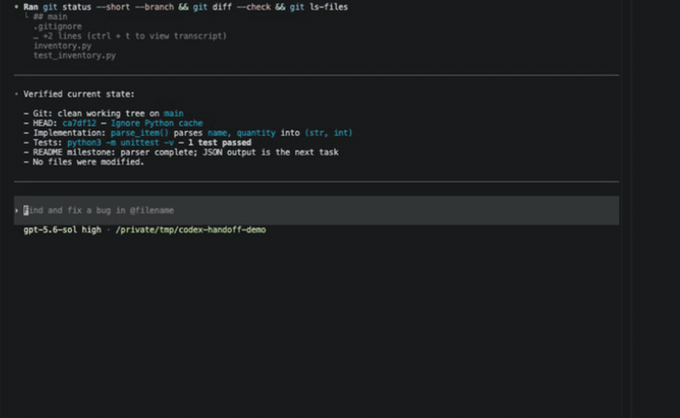
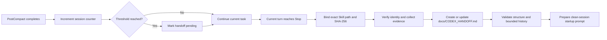

# Codex Handoff

[](https://github.com/HaoPan036/codex-handoff/actions/workflows/ci.yml)
[](LICENSE)
[](pyproject.toml)
[](#compatibility-and-limitations)

**Verified handoffs for long-running Codex sessions.**

Repeated context compaction can make it harder for Codex to know what is actually true in the repository. Codex Handoff waits for a safe turn boundary, rebuilds continuation state from repository evidence, and records it in `docs/CODEX_HANDOFF.md` for a clean session.

[中文说明](README.zh-CN.md)



<p align="center"><sub>Real Codex host run, cropped for privacy and pacing. Three completed compactions trigger one safe handoff; the handoff validates and leaves a clean-session prompt ready.</sub></p>

| Safe timing | Verified state | Clean continuation |
| --- | --- | --- |
| Waits until the active turn reaches a normal `Stop` boundary. | Reconstructs state from Git, repository files, tests, artifacts, and `AGENTS.md`. | Creates a structured, validated `docs/CODEX_HANDOFF.md` for the next session. |

## Quick start

The profile installer remains the shortest setup path. The Plugin package has passed isolated CLI installation checks and a real Codex host test covering Hook trust, two threshold cycles, Skill execution, validated handoff updates, loop prevention, and clean-session continuation.

```bash
git clone https://github.com/HaoPan036/codex-handoff.git
cd codex-handoff
bash install.sh 3
```

Restart Codex, review and trust the installed hooks, then work normally. The final argument is the number of completed compactions before a handoff is scheduled.

You can request a handoff at any milestone without waiting for the threshold:

```text
$codex-handoff
```

The result is written to `docs/CODEX_HANDOFF.md`. Use `$codex-handoff handoff only` to create and validate the document without opening a new session.

## Why Codex Handoff

A long task can survive one context compaction. After several compactions, it becomes harder for a continuing session to answer basic questions with confidence:

- What is already complete?
- Which files are staged, unstaged, or untracked?
- Which decisions and project rules still apply?
- Which tests actually ran and passed?
- What is the one next task?

A chat summary can repeat what the conversation said. Codex Handoff instead creates a durable repository artifact from evidence that a fresh session can inspect again. When evidence cannot establish an important fact, the handoff marks it `UNKNOWN`.

## How it works

The automatic lifecycle separates counting from action. `PostCompact` records a completed compaction and never steers the model. Reaching the threshold only marks a handoff as pending. The current task, tool call, test, or subagent continues until the turn naturally reaches `Stop`.

At that boundary, the hook resolves its own Skill from the host-provided Plugin root (or the exact profile-installer path), verifies the Skill name, and records its SHA-256. The continuation verifies that identity again before reading the exact `SKILL.md`; it never searches for a similar handoff Skill. The workflow then inspects the repository, writes and validates the handoff, and makes a best-effort attempt to open a clean Codex session.

### Technical flow



See [docs/design.md](docs/design.md) for the state machine, trust boundary, and evidence hierarchy.

## Automatic handoff

With the default threshold of 3:

1. Three completed `PostCompact` events are recorded for the session.
2. The active task continues without interruption.
3. At the next normal `Stop`, the hook binds the continuation to its exact `codex-handoff/SKILL.md` path and SHA-256.
4. The continuation verifies that identity, reads only that workflow, creates or updates `docs/CODEX_HANDOFF.md`, validates it, and prepares a clean continuation.

If the exact Skill or its verifier is unavailable, automatic handoff fails clearly with `CODEX_HANDOFF_SKILL_UNAVAILABLE`; it does not substitute `handoff` or any other similarly named Skill. Manual `$codex-handoff` invocation remains explicit-only.

The per-handoff counter resets after the request, so another handoff can occur after the next configured number of compactions. `stop_hook_active` prevents the continuation from scheduling itself again.

## Manual handoff

Invoke the Skill at any milestone:

```text
$codex-handoff
```

To create and validate the document without opening a new session:

```text
$codex-handoff handoff only
```

Manual use follows the same evidence and safety rules as the automatic flow.

## What `CODEX_HANDOFF.md` contains

The handoff uses a stable 11-section contract:

1. Objective and scope
2. Verified current state
3. Architecture and data flow
4. Decisions, constraints, and rejected approaches
5. Relevant files and symbols
6. Verification commands and results
7. Working tree state
8. Known issues, risks, and unknowns
9. One next concrete task
10. New-session startup checklist
11. Five-entry bounded history

Sections 1 through 10 are rewritten from current evidence. Section 11 retains only the five most recent handoffs. The validator rejects missing sections, unresolved placeholders, vague next tasks, oversized documents, and longer histories.

See [examples/CODEX_HANDOFF.example.md](examples/CODEX_HANDOFF.example.md) for a complete example.

## Safety model

During handoff preparation, the Skill is instructed to:

- update only `docs/CODEX_HANDOFF.md`
- preserve staged, unstaged, and untracked work
- avoid commit, push, reset, clean, discard, stash, archive, and delete actions unless explicitly requested
- mark unverified material claims as `UNKNOWN`
- exclude credentials, secrets, complete large logs, and full diffs

The hook does not read repository files or transcripts. It receives lifecycle event metadata, updates a local counter and bounded audit log, and emits a continuation decision only at the configured boundary. It makes no network calls and performs no repository mutation. Codex Handoff has no telemetry.

See [SECURITY.md](SECURITY.md) for the security boundary and reporting process.

## Installation details

### Profile installer

The profile installer requires Python 3.11 or newer and installs the Skill and hooks directly into your user profile:

```bash
git clone https://github.com/HaoPan036/codex-handoff.git
cd codex-handoff
bash install.sh 3
```

It:

- installs the Skill at `~/.agents/skills/codex-handoff/`
- installs the hook at `~/.codex/hooks/codex_handoff_hook.py`
- backs up and updates `~/.codex/config.toml`
- removes hook blocks from earlier `codex-handoff-session` packages
- migrates compatible v3 compact counters when possible
- pins both lifecycle Hook commands to the installed `~/.agents/skills/codex-handoff/SKILL.md`

Restart Codex and review the exact hook definition after installation.

### Codex Plugin Marketplace

The repository includes a Plugin package and marketplace metadata. On 2026-08-11, Codex CLI `0.147.0-alpha.6.5` successfully discovered and installed version `0.1.0` from both a local checkout and the public `HaoPan036/codex-handoff` shorthand in isolated `CODEX_HOME` directories. The public cached package matched the current manifest, Hook, Skill, and helper hashes. A model-backed Codex CLI session then trusted the bundled hooks and completed two host-emitted threshold cycles in a disposable repository: six real `PostCompact` events produced two safe handoff continuations, the per-handoff counter reset twice, both handoff documents passed validation, and each continuation ended without a loop. On the second cycle, `codex://new` opened a clean session that independently verified the handoff and repository state.

See the [2026-08-11 lifecycle evidence and its corrected identity scope](docs/smoke-test-2026-08-11.md), plus the [2026-08-12 Skill-identity regression evidence](docs/smoke-test-2026-08-12.md).

```bash
codex plugin marketplace add HaoPan036/codex-handoff
```

If you are migrating from the profile-installed `codex-handoff-session` v4, do not leave both Hook sets enabled. From the current checkout, run `bash uninstall.sh` to remove the old profile Skill and hooks while retaining their local state, then install and trust the Plugin hooks.

Then open `/plugins` in Codex CLI or the Plugins Directory in the ChatGPT desktop app, install `Codex Handoff`, start a new session, and review the bundled hooks through `/hooks` before trusting them. The repository marketplace is at `.agents/plugins/marketplace.json`; the package is at `plugins/codex-handoff/`.

The command shape and trust flow follow the official OpenAI documentation for [packaging Codex plugins](https://developers.openai.com/plugins/build/plugins) and [Codex hooks](https://developers.openai.com/codex/hooks).

### Uninstall

Remove a profile installation while retaining local counters and logs:

```bash
bash uninstall.sh
```

Remove its local state too:

```bash
bash uninstall.sh --purge-state
```

For a Plugin installation, disable or remove the Plugin through `/plugins` or the Plugins Directory.

## Configuration

### Profile installation

Run the installer again with a new threshold:

```bash
bash install.sh 5
```

### Plugin installation

Create `~/.codex/codex-handoff.json`:

```json
{
  "compact_threshold": 3
}
```

`CODEX_HANDOFF_COMPACT_THRESHOLD` takes priority when set. Plugin mode stores state under the host-provided `PLUGIN_DATA` directory.

Profile mode stores state at:

```text
~/.codex/codex-handoff/state.json
~/.codex/codex-handoff/events.jsonl
```

The audit log rotates after approximately 1 MB. Session records older than 30 days are removed when the hook runs.

## Compatibility and limitations

- Current version: [`v0.1.1`](https://github.com/HaoPan036/codex-handoff/releases/tag/v0.1.1).
- Automated tests run on macOS and Linux with Python 3.11, 3.12, and 3.13 in the repository CI workflow.
- Python 3.11 or newer is required by the profile installer. Runtime helpers use only the Python standard library.
- Packaged hook commands currently target macOS and Linux shells.
- Codex Plugins are available in Codex CLI and the ChatGPT desktop app, but not in the IDE extension. The profile installer remains the compatibility path for the IDE extension.
- Local and public GitHub Marketplace discovery and installation have passed isolated smoke tests. Interactive Hook trust, host-emitted events, recurring threshold cycles, deterministic Skill-path and hash verification, validated handoffs, and loop prevention have passed model-backed macOS host tests. See the [identity evidence](docs/smoke-test-2026-08-12.md), the [earlier lifecycle evidence](docs/smoke-test-2026-08-11.md), [the demo guide](docs/demo.md), and [the release checklist](docs/release-checklist.md).
- The `codex://new` clean-session opener is best effort. If the operating system cannot open it, the helper prints the complete startup prompt for manual use.
- A validated handoff remains useful when automatic session opening is unavailable.

## Development

Run the full local validation suite:

```bash
python3 -m unittest discover -s tests -v
python3 scripts/validate_package.py
```

The tests cover threshold behavior, exact Skill identity and failure, competing-Skill rejection, valid `Stop` JSON, safe continuation boundaries, recurring handoffs, state retention, snapshot collection, handoff validation, session-opening fallback, installer upgrades, and package metadata.

Read [CONTRIBUTING.md](CONTRIBUTING.md) and [docs/design.md](docs/design.md) before changing the lifecycle contract. See [docs/troubleshooting.md](docs/troubleshooting.md) for common installation and runtime problems.

## Project layout

```text
.agents/plugins/marketplace.json
.github/workflows/ci.yml
plugins/codex-handoff/
  .codex-plugin/plugin.json
  hooks/
    hooks.json
    codex_handoff_hook.py
  skills/codex-handoff/
    SKILL.md
    agents/openai.yaml
    assets/CODEX_HANDOFF.template.md
    scripts/
      verify_identity.py
docs/
  assets/
    codex-handoff-demo.gif
    codex-handoff-flow.svg
  demo.md
  smoke-test-2026-08-11.md
  smoke-test-2026-08-12.md
scripts/
  install_profile.py
  uninstall_profile.py
  validate_package.py
tests/
```

## Roadmap

- Publish a community announcement and collect installation feedback.
- Add Windows hook command packaging.
- Collect external usage feedback before expanding the handoff schema.

## License

MIT. See [LICENSE](LICENSE).
