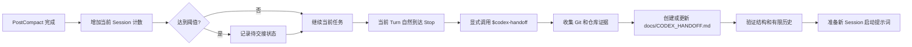

# Codex Handoff

**让长时间运行的 Codex 任务在新 Session 中可靠延续。**

Codex Handoff 会统计已经完成的上下文压缩次数，在当前任务自然结束后触发交接，让 Codex 根据仓库、Git、测试和项目规则生成经过验证的 `docs/CODEX_HANDOFF.md`，再准备一个干净的新 Session。

它基于一个简单原则：聊天上下文会被压缩，仓库状态、Git 历史、测试结果和明确记录的决策更适合作为长期证据。

[English README](README.md)

> 当前版本：`v0.1.0`。自动化测试已经通过，目标环境为 macOS 和 Linux。首次公开发布前仍需在真实 Codex 环境完成一次 Plugin 安装与触发冒烟测试。

## 它解决什么问题

一次上下文压缩通常仍能继续任务。多次压缩之后，新 Session 很难可靠回答以下问题：

- 哪些工作已经完成？
- 当前有哪些 staged、unstaged 和 untracked 变更？
- 哪些设计决策必须保留？
- 哪些测试确实运行并通过？
- 接下来唯一需要执行的任务是什么？

Codex Handoff 会把这些信息沉淀为仓库中的可验证文件，让新 Session 先核对证据，再继续工作。

## 工作流程



`PostCompact` Hook 只负责记账，不会改变模型行为，也不会打断当前 Turn 中的编辑、工具、测试或 Subagent。达到阈值后，系统会等待当前 Turn 自然到达 `Stop`，随后再生成一次继续执行的提示词。

## 核心行为

- **安全边界：** 当前 Turn 到达 `Stop` 后才开始交接。
- **周期触发：** 每次请求交接后计数归零，之后每累计达到阈值都能再次触发。
- **证据优先：** 仓库文件、Git、测试、生成产物和适用的 `AGENTS.md` 优先于聊天记录。
- **保护工作区：** 记录 staged、unstaged 和 untracked 内容，不会自动清理或覆盖。
- **有限历史：** 第 1 至 10 节保存当前状态，第 11 节只保留最近 5 次交接记录。
- **本地运行：** Hook 不访问网络，只保存本地计数和有限大小的审计日志。
- **显式调用：** Skill 关闭隐式触发，手动命令为 `$codex-handoff`。

## 安装

### 方式一：Codex Plugin Marketplace

支持 Plugin 的 Codex 环境优先使用这种方式。

```bash
codex plugin marketplace add haopan036/codex-handoff
```

接下来：

1. 在 Codex CLI 中打开 `/plugins`，或者在 ChatGPT 桌面端打开 Plugins Directory。
2. 选择 `Codex Handoff` Marketplace，安装其中的 `Codex Handoff`。
3. 检查 Hook 定义，并明确授予信任。
4. 新建一个 Codex Session。

仓库中的 Marketplace 文件位于 `.agents/plugins/marketplace.json`，Plugin 包位于 `plugins/codex-handoff/`。

### 方式二：用户级安装脚本

这种方式会把 Skill 和 Hook 直接安装到用户目录，也可以用于升级之前的 v3 或 v4 方案。

```bash
git clone https://github.com/haopan036/codex-handoff.git
cd codex-handoff
bash install.sh 3
```

最后的数字表示累计多少次已完成的 compact 后安排交接。安装脚本会：

- 把 Skill 安装到 `~/.agents/skills/codex-handoff/`
- 把 Hook 安装到 `~/.codex/hooks/codex_handoff_hook.py`
- 备份并更新 `~/.codex/config.toml`
- 清理旧版 `codex-handoff-session` 生成的 Hook 配置
- 尽可能迁移 v3 的 compact 计数

安装后需要重启 Codex，并检查 Hook 定义。

## 使用方式

### 自动交接

默认阈值为 3，正常工作即可：

1. 当前 Session 完成 3 次 `PostCompact`。
2. 当前任务继续执行，不会被中途打断。
3. 当前 Turn 自然到达 `Stop` 时，Hook 生成一条显式调用 `$codex-handoff` 的继续提示词。
4. Skill 创建或更新 `docs/CODEX_HANDOFF.md`，完成验证，并准备干净的新 Session。

### 手动交接

任何里程碑都可以直接调用：

```text
$codex-handoff
```

只生成交接文件，不打开新 Session：

```text
$codex-handoff handoff only
```

## 设置 compact 阈值

### Plugin 安装

创建 `~/.codex/codex-handoff.json`：

```json
{
  "compact_threshold": 3
}
```

环境变量 `CODEX_HANDOFF_COMPACT_THRESHOLD` 的优先级更高。

### 用户级安装

重新执行安装脚本：

```bash
bash install.sh 5
```

## 交接文件包含什么

`docs/CODEX_HANDOFF.md` 使用固定的 11 节结构：

1. 当前目标和范围
2. 已验证的当前状态
3. 架构和数据流
4. 决策、约束和被放弃的方案
5. 相关文件和符号
6. 验证命令与结果
7. 当前工作区状态
8. 已知问题、风险和未知项
9. 一个具体的下一步任务
10. 新 Session 启动检查清单
11. 最近 5 次交接历史

Validator 会拒绝缺少章节、遗留模板占位符、模糊的下一步任务、过大的文档，以及超过 5 条的历史记录。

## 安全边界

交接期间，Skill 会遵守以下规则：

- 只更新 `docs/CODEX_HANDOFF.md`
- 保留 staged、unstaged 和 untracked 工作
- 未获得明确要求时，不执行 commit、push、reset、clean、discard、stash、archive 或 delete
- 无法验证的重要结论标记为 `UNKNOWN`
- 不写入凭证、密钥、大段完整日志和完整 diff

Hook 本身不会读取仓库文件或聊天全文。它只接收生命周期事件元数据、更新本地计数，并在安全边界输出继续决策。

## 本地数据

Plugin 模式使用 Codex 提供的 `PLUGIN_DATA` 目录。用户级安装使用：

```text
~/.codex/codex-handoff/state.json
~/.codex/codex-handoff/events.jsonl
```

审计日志达到约 1 MB 后轮转。超过 30 天的 Session 计数会在 Hook 运行时清理。

项目没有遥测，也不会主动发起网络请求。

## 兼容性与限制

- 用户级安装脚本要求 Python 3.11 或更高版本。运行时辅助脚本只使用 Python 标准库。
- 当前 Hook 命令主要面向 macOS 和 Linux Shell。
- Codex IDE Extension 当前不支持 Plugin。用户级安装脚本保留为兼容路径。
- `codex://new` 自动打开新 Session 的能力采用尽力而为策略。无法打开时，辅助脚本会输出完整的手动启动提示词。
- 自动打开失败不会影响已经验证完成的 handoff 文件。

## 卸载

用户级安装：

```bash
bash uninstall.sh
```

默认保留本地计数和日志。一起删除：

```bash
bash uninstall.sh --purge-state
```

Plugin 安装可以通过 `/plugins` 或 Plugins Directory 禁用或移除。

## 开发与验证

```bash
python3 -m unittest discover -s tests -v
python3 scripts/validate_package.py
```

测试覆盖阈值计数、合法的 `Stop` JSON、安全边界、周期触发、状态保留、Snapshot、Handoff Validator、新 Session 回退、旧版安装升级和 Plugin 元数据。

修改生命周期协议前，请阅读 [CONTRIBUTING.md](CONTRIBUTING.md) 和 [docs/design.md](docs/design.md)。

## License

MIT，详见 [LICENSE](LICENSE)。
