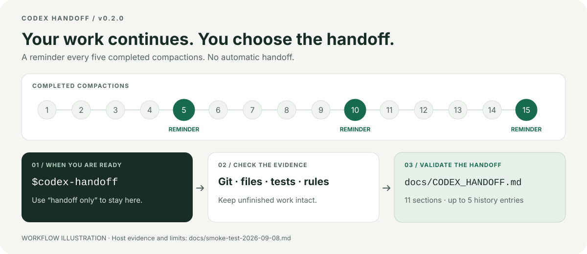

# Codex Handoff

[](https://github.com/HaoPan036/codex-handoff/actions/workflows/ci.yml)
[](LICENSE)
[](pyproject.toml)
[](#兼容性与限制)

**让长时间运行的 Codex Session 在 context compaction 后继续相信可验证的仓库事实。**

Hook 在第 5、10、15… 次已完成压缩时提醒，不打断任务。由你决定何时手动调用 `$codex-handoff`，再核验仓库并生成 `docs/CODEX_HANDOFF.md`。次数只是提醒节奏，不是模型质量的失效阈值。

[English README](README.md)



<p align="center"><sub>这是流程示意图，不是屏幕录像。<a href="docs/demo.md">操作演示</a> · <a href="docs/smoke-test-2026-09-08.md">9 月 8 日验收证据</a></sub></p>

| 安全时机 | 可验证状态 | 干净延续 |
| --- | --- | --- |
| 非阻塞提醒；只有显式调用才交接。 | 根据 Git、仓库文件、测试、产物和 `AGENTS.md` 重建状态。 | 生成结构固定且经过校验的 `docs/CODEX_HANDOFF.md`，交给新 Session。 |

## 快速开始

用户级安装脚本提供仅显式调用的 Skill 和提醒 Hook。安装前请用 `python3 --version` 确认版本为 3.11 或更高。

```bash
git clone --branch v0.2.0 https://github.com/HaoPan036/codex-handoff.git
cd codex-handoff
bash install.sh 5
```

如果 macOS 的 `python3` 指向旧版系统 Python，请直接使用已安装的 3.11+ 解释器：`python3.11 scripts/install_profile.py --threshold 5`。

安装后重启 Codex，检查并信任新安装的 Hook。最后一个数字表示每累计多少次 compaction 提醒一次。

任何里程碑都可以手动交接，无需等待阈值。

```text
$codex-handoff
```

结果写入 `docs/CODEX_HANDOFF.md`。如果只想生成并校验文件，不打开新 Session，可以使用 `$codex-handoff handoff only`。

## 为什么需要 Codex Handoff

压缩次数本身不能证明回答质量下降；到达里程碑或任务状态不清时，交接可以帮助核验这些问题。

- 哪些工作已经完成？
- 当前有哪些 staged、unstaged 和 untracked 变更？
- 哪些设计决策和项目规则仍然有效？
- 哪些测试确实运行并通过？
- 接下来唯一要做的任务是什么？

普通聊天摘要只能复述对话里出现过的内容。Codex Handoff 会根据新 Session 能够再次检查的证据，生成一个长期保存在仓库里的交接文件。重要事实缺少证据时，文件会把它标记为 `UNKNOWN`。

## 工作原理

`PostCompact` 对已完成压缩去重，在 N、2N、3N 次显示非阻塞 `systemMessage`（默认 N=5）。`Stop` 始终只返回 `continue: true`，不发起额外工作。`SessionStart(source=compact)` 区分同一轮中的真实多次压缩；同一会话 resume/startup 保留计数，clear 或新会话重新计数。超过 30 天未活动的状态会过期。

```text
完成压缩 → 去重计数 → 达到倍数？→ 非阻塞提醒
你手动调用 $codex-handoff → 核验事实 → 保存交接 → 干净续接
```

忽略提醒后，直到下一个倍数才再提醒。Hook 不写交接、不打开会话，也不向模型追加续跑指令。[docs/design.md](docs/design.md) 记录状态与迁移边界。

## 手动交接

任何里程碑都可以直接调用 Skill。

```text
$codex-handoff
```

只生成并校验交接文件，不打开新 Session。

```text
$codex-handoff handoff only
```

仅显式手动调用才启动交接，提醒本身不是授权。

默认命令会在原生任务控制可用时创建带标题的干净任务；否则准备 composer 并要求用户按 **Send**。`handoff only` 在生成和校验完成后结束。

## `CODEX_HANDOFF.md` 包含什么

交接文件使用固定的 11 节结构。

1. 当前目标和范围
2. 已验证的当前状态
3. 架构和数据流
4. 决策、约束和被放弃的方案
5. 相关文件和符号
6. 验证命令与结果
7. 当前工作区状态
8. 已知问题、风险和未知项
9. 一个具体的下一步任务
10. 新 Session 启动检查清单
11. 最近 5 次交接历史

第 1 至 10 节每次都根据当前证据重写。第 11 节只保留最近 5 次交接记录。Validator 会拒绝缺少章节、遗留模板占位符、模糊的下一步任务、过大的文档，以及超过 5 条的历史记录。

[examples/CODEX_HANDOFF.example.md](examples/CODEX_HANDOFF.example.md) 提供了一份完整示例。

## 安全模型

准备交接时，Skill 会遵守以下规则。

- 只更新 `docs/CODEX_HANDOFF.md`
- 保留 staged、unstaged 和 untracked 工作
- 未收到明确要求时，不执行 commit、push、reset、clean、discard、stash、archive 和 delete
- 无法验证的重要结论标记为 `UNKNOWN`
- 不写入凭证、密钥、大段完整日志和完整 diff

Hook 不会读取仓库文件或 transcript。它只接收生命周期事件元数据，更新本地计数和有大小限制的审计日志，并在配置的计数倍数显示非阻塞提醒。Hook 不访问网络，也不修改仓库。Codex Handoff 不收集 telemetry。

[SECURITY.md](SECURITY.md) 记录了安全边界和漏洞报告方式。

## 安装细节

### 用户级安装脚本

安装脚本要求 Python 3.11 或更高版本，会把 Skill 和 Hook 直接安装到用户目录。

```bash
git clone --branch v0.2.0 https://github.com/HaoPan036/codex-handoff.git
cd codex-handoff
bash install.sh 5
```

脚本会完成这些操作。

- 把 Skill 安装到 `~/.agents/skills/codex-handoff/`
- 把 Hook 安装到 `~/.codex/hooks/codex_handoff_hook.py`
- 备份并更新 `~/.codex/config.toml`
- 删除旧版 `codex-handoff-session` 写入的 Hook 配置
- 保留旧版 lifetime total 供诊断，同时隔离无法验证的 active count 和 pending flag
- 为兼容保留 profile 命令中的已安装 Skill 路径；提醒 Hook 不读取或调用它
- 检测到 Plugin 与 profile Hook 同时启用时给出强 warning

随时可以运行只读安装诊断：

```bash
python3 scripts/doctor.py
```

安装后需要重启 Codex，并检查 Hook 的完整定义。

### Codex Plugin Marketplace

仓库包含 Plugin 包和 Marketplace metadata。v0.2.0 的具体安装模式与宿主覆盖范围见[本次验收记录](docs/smoke-test-2026-09-08.md)。[八月的安装与自动交接测试](docs/smoke-test-2026-08-11.md) 仅作为历史证据保留。

```bash
codex plugin marketplace add HaoPan036/codex-handoff
```

从用户级安装的 `codex-handoff-session` v4 迁移时，不要同时启用两套 Hook。先在当前 checkout 中运行 `bash uninstall.sh`，删除旧版 profile Skill 和 Hook。本地状态默认保留。随后再安装并信任 Plugin Hook。

随后在 Codex CLI 中打开 `/plugins`，或者在 ChatGPT 桌面端打开 Plugins Directory，安装 `Codex Handoff` 并新建 Session。通过 `/hooks` 查看 bundled Hook，确认完整定义后再授予信任。仓库中的 Marketplace 文件位于 `.agents/plugins/marketplace.json`，Plugin 包位于 `plugins/codex-handoff/`。

升级时刷新 Marketplace，确认安装版本为 **0.2.0**，重启会话并重新检查 Hook。用户级安装与 Marketplace 是两种安装方式，只保留一套启用的 Hook。旧版已验证计数可以延续新提醒节奏，但旧的待交接状态不会自动执行。

命令格式和 Hook trust 流程参考 OpenAI 官方的 [Codex Plugin 打包文档](https://developers.openai.com/plugins/build/plugins) 与 [Codex Hooks 文档](https://developers.openai.com/codex/hooks)。

### 卸载

删除用户级安装，保留本地计数和日志。

```bash
bash uninstall.sh
```

同时删除本地状态。

```bash
bash uninstall.sh --purge-state
```

Plugin 安装可以通过 `/plugins` 或 Plugins Directory 禁用或移除。

## 配置

### 用户级安装

重新执行安装脚本即可修改阈值。

```bash
bash install.sh 5
```

### Plugin 安装

创建 `~/.codex/codex-handoff.json`。

```json
{
  "compact_threshold": 5
}
```

环境变量 `CODEX_HANDOFF_COMPACT_THRESHOLD` 的优先级更高。Plugin 模式把状态保存在 Codex 提供的 `PLUGIN_DATA` 目录。

用户级安装把状态保存在以下路径。

```text
~/.codex/codex-handoff/state.json
~/.codex/codex-handoff/events.jsonl
```

审计日志达到约 1 MB 后轮转。超过 30 天的 Session 记录会在 Hook 运行时清理。

## 兼容性与限制

- 当前版本为 [`v0.2.0`](https://github.com/HaoPan036/codex-handoff/releases/tag/v0.2.0)。
- 仓库 CI 在 macOS 和 Linux 上使用 Python 3.11、3.12 和 3.13 运行自动化测试。
- 用户级安装脚本要求 Python 3.11 或更高版本。运行时辅助脚本只使用 Python 标准库。
- 当前打包的 Hook 命令面向 macOS 和 Linux shell。
- Codex Plugin 可用于 Codex CLI 和 ChatGPT 桌面端，IDE Extension 暂不支持。IDE Extension 可以使用用户级安装脚本。
- 当前提醒与手动交接的验证范围见 [9 月 8 日验收记录](docs/smoke-test-2026-09-08.md)，其中区分真实宿主事件、界面证据、隔离测试和续接行为。另见[操作演示](docs/demo.md)和[发布检查表](docs/release-checklist.md)。
- [`codex://new` 续接能力](https://developers.openai.com/codex/app/commands/#deeplinks)采用尽力而为策略。OS dispatch 成功表示请求打开预填 prompt 的新 composer，不代表已验证 thread 创建，也绝不会自动提交 prompt。请按 **Send**。dispatch 失败时，helper 会输出完整的手动启动提示词。
- 桌面端使用原生任务列表和带标题的任务创建，因此序号标题会在创建时直接应用。便携回退路径可以使用稳定的 App Server `thread/read`，但受限的嵌套 Host sandbox 可能阻止这次读取，此时会回退为 workspace 名称。请求名称与已验证名称仍分开报告。
- 自动打开失败不会影响已经校验完成的 handoff 文件。

## 开发与验证

运行完整的本地验证。

```bash
python3 -m unittest discover -s tests -v
python3 scripts/validate_package.py
```

测试覆盖 5/10/15 次提醒、中间及重复事件静默、resume/clear、旧状态迁移、缺失 Skill 不阻塞提醒、Stop 不调度、identity helper、doctor、snapshot、handoff validator、deep-link 结果、安装升级和 Plugin metadata。两条命令均使用 Python 3.11+ 解释器。

从已提交版本构建发布包：`python3 scripts/create_release.py --ref v0.2.0`。打包器读取 Git 提交中的内容和文件权限，不包含本地修改或未跟踪文件；输出为 `dist/codex-handoff-v0.2.0.zip` 和 `dist/SHA256SUMS.txt`。

修改生命周期协议前，请阅读 [CONTRIBUTING.md](CONTRIBUTING.md) 和 [docs/design.md](docs/design.md)。常见安装与运行问题见 [docs/troubleshooting.md](docs/troubleshooting.md)。

## 项目结构

```text
.agents/plugins/marketplace.json
.github/workflows/ci.yml
plugins/codex-handoff/
  .codex-plugin/plugin.json
  hooks/
    hooks.json
    codex_handoff_hook.py
  skills/codex-handoff/
    SKILL.md
    agents/openai.yaml
    assets/CODEX_HANDOFF.template.md
    scripts/
      verify_identity.py
docs/
  assets/
    codex-handoff-flow.svg
  demo.md
  smoke-test-2026-09-08.md
scripts/
  install_profile.py
  uninstall_profile.py
  validate_package.py
tests/
```

## Roadmap

- 发布社区公告并收集安装反馈。
- 加入 Windows Hook command packaging。
- 收集外部使用反馈，再考虑扩展 handoff schema。

## License

项目采用 MIT License，详见 [LICENSE](LICENSE)。
